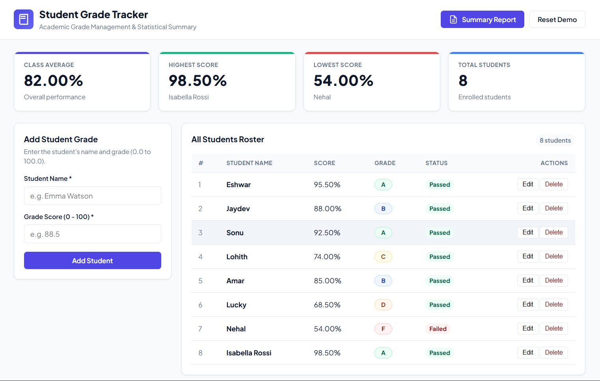
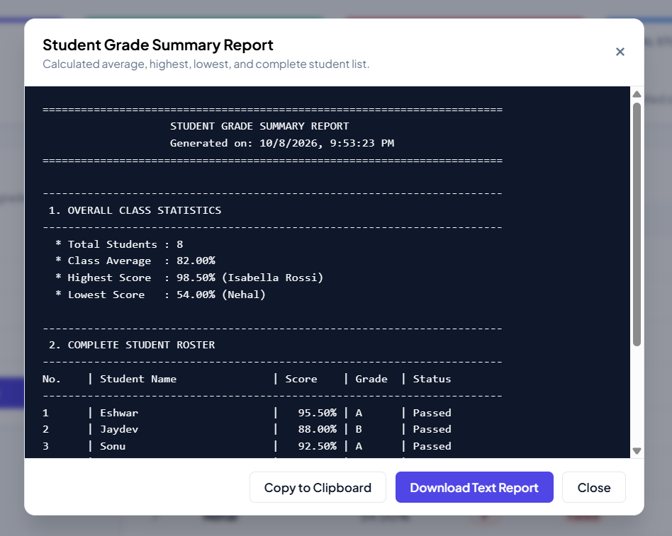

# 🎓 Student Grade Tracker

> A professional and lightweight web-based Student Grade Management System built using **Core Java, Object-Oriented Programming, Java Collections, Java HTTP Server, HTML5, CSS3, and Vanilla JavaScript**.

---

## 📌 Project Overview

**Student Grade Tracker** is a web-based academic grade management application designed to simplify the process of managing student scores and analyzing class performance.

The application allows users to add, view, edit, and delete student records through a modern web interface. It automatically calculates letter grades, pass/fail status, class average, highest score, and lowest score.

The system also provides a **Student Grade Summary Report** that presents complete class performance information in a structured format. The generated report can be copied to the clipboard or downloaded as a text file.

The project is intentionally developed using **Core Java and lightweight web technologies** without relying on frameworks such as Spring Boot, React, Angular, or Vue. This makes the project suitable for demonstrating fundamental Java programming, Object-Oriented Programming, Collections, HTTP communication, and frontend integration.

---

# 🎯 Project Objective

The primary objective of this project is to develop a simple but functional student grade management system while applying fundamental programming and web development concepts.

The project demonstrates how:

- Core Java can be used to implement application logic
- Object-Oriented Programming can organize application components
- Java Collections can manage student records
- A Java HTTP Server can provide backend services
- REST-style APIs can connect frontend and backend
- HTML, CSS, and JavaScript can create a modern user interface
- Mathematical calculations can be used to analyze academic performance
- Reports can be generated dynamically from application data

---

# ✨ Key Features

### 👨‍🎓 Student Management

- Add new student records
- View all students
- Edit existing student records
- Delete student records
- Reset demonstration data

### 📊 Grade Management

- Automatic letter-grade calculation
- Automatic Pass/Fail calculation
- Score validation
- Support for decimal scores
- Score rounding

### 📈 Class Performance

- Total student count
- Class average
- Highest score
- Highest-scoring student
- Lowest score
- Lowest-scoring student

### 📄 Report Generation

- Generate complete Student Grade Summary Report
- Display overall class statistics
- Display complete student roster
- Include individual scores
- Include letter grades
- Include Pass/Fail status
- Copy report to clipboard
- Download report as `.txt`

### 🎨 User Interface

- Professional dashboard
- Responsive layout
- Statistics cards
- Structured student table
- Grade badges
- Pass/Fail indicators
- Interactive buttons
- Dialog-based report display
- Toast/notification feedback
- Mobile-friendly design

---

# 🖥️ Application Preview

## 📊 Dashboard

The main dashboard provides an overview of class performance and allows users to manage student records.


### Dashboard Components

The dashboard provides the following information:

| Component | Description |
|---|---|
| Class Average | Average score of all students |
| Highest Score | Highest score recorded |
| Lowest Score | Lowest score recorded |
| Total Students | Number of students in the roster |
| Add Student | Form for adding a new student |
| Student Roster | Complete list of students |
| Edit | Modify an existing student |
| Delete | Remove a student |
| Summary Report | Generate a detailed report |
| Reset Demo | Restore demonstration data |

---

# 📄 Student Grade Summary Report

The application includes a dedicated **Summary Report** feature.


The report provides a structured overview of the class.

### Report Information

- Report generation date and time
- Total number of students
- Class average
- Highest score
- Highest-scoring student
- Lowest score
- Lowest-scoring student
- Complete student roster
- Student scores
- Letter grades
- Pass/Fail status

### Report Actions

The generated report can be:

- 📋 Copied to the clipboard
- 💾 Downloaded as a `.txt` file

---

# 📚 Grade Calculation System

The application automatically assigns a letter grade based on the student's score.

| Score Range | Grade |
|---:|:---:|
| 90 – 100 | A |
| 80 – 89.99 | B |
| 70 – 79.99 | C |
| 60 – 69.99 | D |
| 0 – 59.99 | F |

---

## ✅ Pass/Fail Calculation

The passing score is:

```text
Score >= 60
```

Therefore:

```text
Score >= 60  → Passed
Score < 60   → Failed
```

---

# 📊 Class Statistics

The system automatically calculates class-level performance statistics.

### Statistics Provided

#### Total Students

The total number of students currently stored in the student roster.

#### Class Average

The average score of all students.

```text
Class Average = Sum of all student scores / Number of students
```

#### Highest Score

The highest score among all students.

#### Lowest Score

The lowest score among all students.

#### Highest-Scoring Student

The student who achieved the highest score.

#### Lowest-Scoring Student

The student who achieved the lowest score.

---

# 📋 Example Class Statistics

```text
Total Students : 8
Class Average  : 82.00%
Highest Score  : 98.50% (Isabella Rossi)
Lowest Score   : 54.00% (Nehal)
```

---

# 📄 Example Summary Report

```text
======================================================================
                     STUDENT GRADE SUMMARY REPORT
                    Generated on: 10/8/2026, 9:53:23 PM
======================================================================

----------------------------------------------------------------------
1. OVERALL CLASS STATISTICS
----------------------------------------------------------------------

* Total Students : 8
* Class Average  : 82.00%
* Highest Score  : 98.50% (Isabella Rossi)
* Lowest Score   : 54.00% (Nehal)

----------------------------------------------------------------------
2. COMPLETE STUDENT ROSTER
----------------------------------------------------------------------

No.   | Student Name          | Score   | Grade | Status
----------------------------------------------------------------------
1     | Eshwar                | 95.50%  | A     | Passed
2     | Jaydev                | 88.00%  | B     | Passed
3     | Sonu                  | 92.50%  | A     | Passed
4     | Lohith                | 74.00%  | C     | Passed
5     | Amar                  | 85.00%  | B     | Passed
6     | Lucky                 | 68.50%  | D     | Passed
7     | Nehal                 | 54.00%  | F     | Failed
8     | Isabella Rossi        | 98.50%  | A     | Passed
```

---

# 🏗️ System Architecture

The application follows a lightweight client-server architecture.

```text
                    ┌─────────────────────────┐
                    │       WEB BROWSER       │
                    │                         │
                    │   HTML + CSS + JS       │
                    └────────────┬────────────┘
                                 │
                                 │ HTTP / JSON
                                 ▼
                    ┌─────────────────────────┐
                    │      JAVA BACKEND       │
                    │                         │
                    │    Java HTTP Server     │
                    └────────────┬────────────┘
                                 │
                                 ▼
                    ┌─────────────────────────┐
                    │       API HANDLER       │
                    │                         │
                    │ GET / POST / PUT /      │
                    │ DELETE                  │
                    └────────────┬────────────┘
                                 │
                                 ▼
                    ┌─────────────────────────┐
                    │      GRADE TRACKER      │
                    │                         │
                    │ Business Logic          │
                    │ Statistics              │
                    │ Report Generation       │
                    └────────────┬────────────┘
                                 │
                                 ▼
                    ┌─────────────────────────┐
                    │        STUDENT          │
                    │                         │
                    │ Data Model              │
                    │ Name                    │
                    │ Score                   │
                    │ Grade                   │
                    │ Status                  │
                    └─────────────────────────┘
```

---

# 🔄 Application Workflow

```text
                         START
                           │
                           ▼
                 ┌──────────────────┐
                 │ Start Java Server│
                 └────────┬─────────┘
                          │
                          ▼
                 ┌──────────────────┐
                 │  Open Dashboard  │
                 └────────┬─────────┘
                          │
             ┌────────────┼────────────┐
             │            │            │
             ▼            ▼            ▼
        Add Student   Edit Student  Delete Student
             │            │            │
             └────────────┼────────────┘
                          │
                          ▼
                 ┌──────────────────┐
                 │ Validate Input   │
                 └────────┬─────────┘
                          │
                          ▼
                 ┌──────────────────┐
                 │ Update Student   │
                 │ Collection       │
                 └────────┬─────────┘
                          │
                          ▼
                 ┌──────────────────┐
                 │ Calculate Grades │
                 │ & Statistics     │
                 └────────┬─────────┘
                          │
             ┌────────────┼────────────┐
             ▼            ▼            ▼
          Average      Highest       Lowest
             │            │            │
             └────────────┼────────────┘
                          │
                          ▼
                 ┌──────────────────┐
                 │ Generate Report  │
                 └────────┬─────────┘
                          │
                   ┌──────┴──────┐
                   ▼             ▼
                Copy          Download
```

---

# 📁 Project Structure

```text
CodeAlpha_Student_Grade_Tracker/
│
├── Main.java
├── GradeTracker.java
├── Student.java
│
├── web/
│   ├── index.html
│   │
│   ├── css/
│   │   └── style.css
│   │
│   └── js/
│       └── app.js
│
├── screenshots/
│   ├── dashboard.png
│   └── summary-report.png
│
└── README.md
```

---

# 🧩 Project Components

## 1. `Student.java`

The `Student` class represents an individual student.

### Responsibilities

- Store student name
- Store student score
- Validate student information
- Calculate letter grade
- Determine Pass/Fail status
- Round score values
- Provide student information to other components

### Student Data

Each student contains information such as:

```text
Name
Score
Grade
Status
```

---

# 2. `GradeTracker.java`

The `GradeTracker` class contains the main business logic.

### Responsibilities

- Store student records
- Add students
- Update students
- Remove students
- Retrieve students
- Calculate average score
- Find highest score
- Find lowest score
- Identify highest-scoring student
- Identify lowest-scoring student
- Generate summary reports
- Reset demonstration data

The application uses Java's:

```java
ArrayList<Student>
```

to store student records in memory.

---

# 3. `Main.java`

`Main.java` acts as the entry point of the application and starts the Java HTTP server.

### Responsibilities

- Start the application
- Create the Java HTTP server
- Listen on port `8080`
- Handle HTTP requests
- Route API requests
- Serve frontend files
- Process JSON data
- Return JSON responses
- Open the application in the default browser

---

# 4. `web/index.html`

The HTML file defines the structure of the web application.

### Contains

- Application header
- Dashboard
- Statistics cards
- Add Student form
- Student roster
- Action buttons
- Summary Report dialog
- Report controls

---

# 5. `web/css/style.css`

The CSS file controls the visual appearance of the application.

### Includes

- Dashboard layout
- Responsive design
- Statistics cards
- Student table
- Buttons
- Forms
- Grade badges
- Pass/Fail badges
- Dialog styling
- Notifications
- Mobile-friendly layout

---

# 6. `web/js/app.js`

The JavaScript file provides frontend functionality.

### Responsibilities

- Communicate with backend APIs
- Fetch student records
- Add students
- Edit students
- Delete students
- Update dashboard statistics
- Render student table
- Calculate/display information
- Generate reports
- Copy reports
- Download reports
- Handle user interactions
- Manage LocalStorage fallback

---

# 🔌 REST-Style API

The backend provides lightweight REST-style API endpoints.

---

## GET All Students

```http
GET /api/students
```

Returns all student records.

### Example Response

```json
[
  {
    "name": "Eshwar",
    "score": 95.5,
    "grade": "A",
    "status": "Passed"
  }
]
```

---

## POST Add Student

```http
POST /api/students
```

### Example Request

```json
{
  "name": "Emma Watson",
  "score": 88.5
}
```

---

## PUT Update Student

```http
PUT /api/students?index=0
```

### Example Request

```json
{
  "name": "Emma Watson",
  "score": 91.5
}
```

---

## DELETE Student

```http
DELETE /api/students?index=0
```

Deletes the student at the specified index.

---

## GET Class Summary

```http
GET /api/summary
```

Returns class-level statistics.

### Example Response

```json
{
  "total": 8,
  "average": 82.0,
  "highest": 98.5,
  "topStudent": "Isabella Rossi",
  "lowest": 54.0,
  "lowestStudent": "Nehal"
}
```

---

## GET Report

```http
GET /api/report
```

Generates the Student Grade Summary Report.

---

## POST Reset

```http
POST /api/reset
```

Restores the demonstration student data.

---

# 🛠️ Technologies Used

## Backend Technologies

- Java
- Core Java
- Object-Oriented Programming
- Java Collections Framework
- `ArrayList`
- Java HTTP Server
- HTTP request handling
- JSON processing
- Java I/O
- Java Time API
- `ExecutorService`

## Frontend Technologies

- HTML5
- CSS3
- Vanilla JavaScript
- Fetch API
- DOM Manipulation
- LocalStorage API
- Clipboard API
- HTML Dialog API
- Responsive CSS

---

# 🧠 Core Java Concepts Demonstrated

This project demonstrates several fundamental Java concepts.

### Classes and Objects

The project uses classes such as:

```text
Student
GradeTracker
Main
```

### Encapsulation

Student information and related operations are organized within the `Student` class.

### Collections

Student records are managed using:

```java
ArrayList<Student>
```

### Methods

Separate methods are used for:

- Adding students
- Updating students
- Deleting students
- Calculating grades
- Calculating statistics
- Generating reports

### Exception Handling

Input and application errors are handled to prevent invalid operations from crashing the application.

### Input Validation

Scores and student names are validated before processing.

---

# 🚫 Frameworks and External Dependencies

The project intentionally avoids heavyweight frameworks.

```text
Spring Boot       ❌
Hibernate         ❌
MySQL             ❌
MongoDB           ❌
React             ❌
Angular           ❌
Vue               ❌
Node.js           ❌
```

The application is built using:

```text
Core Java
    +
Java HTTP Server
    +
HTML5
    +
CSS3
    +
Vanilla JavaScript
```

This keeps the project lightweight and focuses on fundamental programming concepts.

---

# 💻 Requirements

Before running the application, make sure you have:

- Java JDK 11 or later
- Modern web browser
- Git (optional)

### No Database Required

The application does not require:

- MySQL
- MongoDB
- PostgreSQL
- Oracle Database
- Any external database server

### No External Backend Server Required

The Java application itself starts the HTTP server.

---

# 🚀 Installation and Setup

## Step 1: Clone the Repository

```bash
git clone https://github.com/chidananda-p/CodeAlpha_Student_Grade_Tracker.git
```

---

## Step 2: Navigate to the Project

```bash
cd CodeAlpha_Student_Grade_Tracker
```

---

## Step 3: Compile the Java Files

```bash
javac Student.java GradeTracker.java Main.java
```

---

## Step 4: Start the Application

```bash
java Main
```

The Java HTTP server will start on:

```text
http://localhost:8080
```

The application may automatically open the default browser.

If the browser does not open automatically, manually visit:

```text
http://localhost:8080
```

---

# 🛑 Stopping the Application

To stop the application, press:

```text
Ctrl + C
```

in the terminal.

---

# 🧪 Input Validation

The application validates user input before adding or updating students.

## Student Name Validation

The student name:

- Cannot be empty
- Is trimmed before processing

### Example

```text
Valid:
Eshwar
Jaydev
Isabella Rossi

Invalid:
(empty)
```

---

## Score Validation

Scores must be between:

```text
0 and 100
```

### Valid Examples

```text
95
88.5
72.25
60
0
100
```

### Invalid Examples

```text
-10
105
abc
```

---

# 💾 Data Storage

The current version primarily stores student records **in memory using Java's `ArrayList`**.

```java
ArrayList<Student>
```

This approach keeps the project lightweight and allows the application to demonstrate Java Collections without requiring a database.

### Data Persistence

Because the Java backend uses in-memory storage, server-side student records are not intended to provide permanent database-style persistence after restarting the server.

The frontend also provides LocalStorage fallback functionality where applicable.

---

# 📊 Sample Student Data

The application can be demonstrated using sample student records such as:

| # | Student | Score | Grade | Status |
|---:|---|---:|:---:|:---:|
| 1 | Eshwar | 95.50% | A | Passed |
| 2 | Jaydev | 88.00% | B | Passed |
| 3 | Sonu | 92.50% | A | Passed |
| 4 | Lohith | 74.00% | C | Passed |
| 5 | Amar | 85.00% | B | Passed |
| 6 | Lucky | 68.50% | D | Passed |
| 7 | Nehal | 54.00% | F | Failed |
| 8 | Isabella Rossi | 98.50% | A | Passed |

---

# 🧮 Grade Calculation Logic

The application follows a simple threshold-based grading system.

```java
if (score >= 90.0) {
    return "A";
}

if (score >= 80.0) {
    return "B";
}

if (score >= 70.0) {
    return "C";
}

if (score >= 60.0) {
    return "D";
}

return "F";
```

---

# ✅ Pass/Fail Logic

```java
if (score >= 60.0) {
    return "Passed";
}

return "Failed";
```

---

# 📈 Average Calculation

The class average is calculated using:

```text
Average = Total of all student scores / Number of students
```

For example:

```text
Scores:

95.5
88.0
92.5
74.0
85.0
68.5
54.0
98.5
```

The application calculates the average dynamically rather than using a hardcoded value.

---

# 🎯 Learning Objectives

This project provides practical experience in several areas.

## Core Java

- Classes
- Objects
- Constructors
- Methods
- Encapsulation
- Conditional statements
- Loops
- Exception handling
- Input validation

## Object-Oriented Programming

- Data modeling
- Encapsulation
- Separation of responsibilities
- Business logic organization

## Java Collections

- `ArrayList`
- Adding elements
- Removing elements
- Updating elements
- Searching
- Iterating
- Aggregate calculations

## Backend Development

- Java HTTP Server
- HTTP methods
- Request handling
- API routing
- JSON communication
- Static file serving
- Server-side business logic

## Frontend Development

- HTML5
- CSS3
- JavaScript
- DOM manipulation
- Fetch API
- LocalStorage
- Clipboard API
- Responsive design

---

# 📸 Screenshots

## Dashboard



The dashboard provides an overview of the class and allows users to manage student records.

---

## Summary Report



The Summary Report provides detailed information about overall class performance and individual student results.

---

# 🔮 Future Enhancements

The current project focuses on Core Java and lightweight web development.

Possible future enhancements include:

- [ ] MySQL database integration
- [ ] Student ID / Roll Number
- [ ] Subject-wise marks
- [ ] Multiple subjects per student
- [ ] Semester-wise grade management
- [ ] Search functionality
- [ ] Student filtering
- [ ] Sorting by score
- [ ] Sorting by name
- [ ] Attendance management
- [ ] User authentication
- [ ] Admin dashboard
- [ ] PDF report generation
- [ ] CSV export/import
- [ ] Graphs and performance charts
- [ ] Student performance history
- [ ] JUnit automated testing
- [ ] Spring Boot version
- [ ] Cloud deployment

---

# 🔐 Security Considerations

This project is primarily an educational application.

The current version does not implement production-level authentication, authorization, or database security.

For a production-ready version, the following could be added:

- User authentication
- Role-based authorization
- Secure password storage
- HTTPS
- Database security
- Input sanitization
- API authentication
- CSRF protection
- Secure session management
- Server-side validation

---

# 🧪 Testing

The application can be manually tested using the following scenarios.

### Add Student

```text
Enter:
Name: Test Student
Score: 85

Expected:
Student is added
Grade: B
Status: Passed
```

### Add Failed Student

```text
Enter:
Name: Test Student
Score: 45

Expected:
Grade: F
Status: Failed
```

### Edit Student

```text
Change score from:
75 → 95

Expected:
Grade changes from C → A
Status remains Passed
```

### Delete Student

```text
Delete an existing student.

Expected:
Student disappears from the roster.
Class statistics are recalculated.
```

### Generate Report

```text
Click:
Summary Report

Expected:
Complete class report is generated.
```

---

# 🤝 Contributing

Contributions, suggestions, and improvements are welcome.

## 1. Fork the Repository

Fork this repository on GitHub.

## 2. Create a Feature Branch

```bash
git checkout -b feature/your-feature
```

## 3. Make Your Changes

Implement and test your changes.

## 4. Commit Your Changes

```bash
git add .
git commit -m "Add: your feature"
```

## 5. Push Your Branch

```bash
git push origin feature/your-feature
```

Then create a Pull Request.

---

# 📄 License

This project is primarily created for **educational and academic purposes**.

You are free to study, modify, and extend the project according to your requirements.

---

# 👨‍💻 Author

## Chidananda P

**Computer Science & Engineering Student**

### GitHub

https://github.com/chidananda-p

### Project Repository

https://github.com/chidananda-p/CodeAlpha_Student_Grade_Tracker

---

# ⭐ Support

If you find this project useful for learning **Core Java, Object-Oriented Programming, Java Collections, HTTP servers, REST-style APIs, and web application development**, consider giving the repository a ⭐ on GitHub.

---

# 📌 Project Highlights

```text
╔══════════════════════════════════════════════╗
║           STUDENT GRADE TRACKER             ║
╠══════════════════════════════════════════════╣
║                                              ║
║  ✓ Core Java                                 ║
║  ✓ Object-Oriented Programming               ║
║  ✓ Java Collections / ArrayList              ║
║  ✓ CRUD Operations                            ║
║  ✓ Java HTTP Server                           ║
║  ✓ REST-Style API                             ║
║  ✓ JSON Communication                         ║
║  ✓ HTML5                                      ║
║  ✓ CSS3                                       ║
║  ✓ Vanilla JavaScript                         ║
║  ✓ Responsive User Interface                  ║
║  ✓ Automatic Grade Calculation                ║
║  ✓ Class Statistics                           ║
║  ✓ Summary Report Generation                  ║
║  ✓ Clipboard Support                          ║
║  ✓ Text Report Download                       ║
║  ✓ Input Validation                           ║
║                                              ║
║  Database         : Not Required             ║
║  Framework        : None                     ║
║  External Server  : Not Required             ║
║                                              ║
╚══════════════════════════════════════════════╝
```

---

# 🚀 Built With

**Core Java + Java HTTP Server + HTML5 + CSS3 + Vanilla JavaScript**

> A lightweight academic grade management application demonstrating how fundamental Java programming concepts can be combined with web technologies to build a complete, functional, and professional application.
